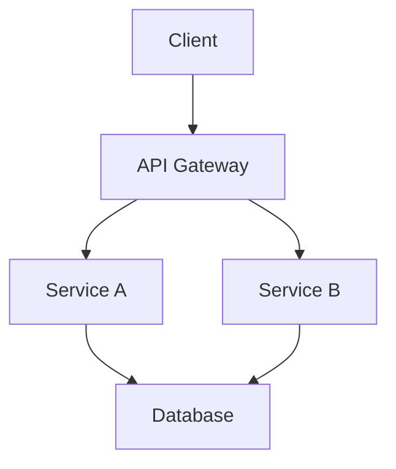

# Generate Documentation Command

---
allowed-tools: Read, Glob, Grep, Write, MultiEdit, Bash(ls:*), Bash(find:*), Bash(tree:*), TodoWrite, WebSearch, mcp__Context7__resolve-library-id, mcp__Context7__get-library-docs
denied-tools: Bash(rm:*), Bash(git push:*), Bash(git commit:*)
description: Generate comprehensive documentation with multiple format support
argument-hint: <component-name|"all"> [format: markdown|jsdoc|sphinx|typedoc]
---

## Context

- Project type: `!ls package.json Cargo.toml go.mod pyproject.toml build.gradle pom.xml 2>/dev/null | head -1`
- Documentation files: `!find . -name "*.md" -o -name "*.txt" | grep -E "(README|readme|CONTRIBUTING|LICENSE|CHANGELOG)" | head -10`
- Source structure: `!tree -d -L 2 src/ lib/ app/ pkg/ 2>/dev/null | head -20`
- Current docs: `!ls docs/ doc/ documentation/ 2>/dev/null | head -10`

## Your task

Generate intelligent, comprehensive documentation that enhances developer experience and project understanding.

## Response Language

Please respond in Japanese (日本語で返信してください)

## Documentation Generation Strategy

### 1. **Intelligent Analysis Phase**

#### Code Understanding
- Extract function signatures and type information
- Analyze code comments and docstrings
- Identify module dependencies and relationships
- Detect design patterns and architectural decisions

#### Project Context
- Determine project type and framework
- Identify documentation conventions
- Analyze existing documentation structure
- Understand target audience (developers, users, contributors)

### 2. **Documentation Types**

#### API Reference
- **Functions/Methods**: Signatures, parameters, returns, throws
- **Classes/Interfaces**: Properties, methods, inheritance
- **Types/Enums**: Values, usage, constraints
- **Modules/Packages**: Exports, dependencies, purpose

#### Architecture Documentation
- **System Overview**: High-level architecture diagram
- **Component Map**: Module relationships and interactions
- **Data Flow**: How data moves through the system
- **Decision Log**: Key architectural choices and rationale

#### Developer Guide
- **Setup Instructions**: Prerequisites, installation, configuration
- **Development Workflow**: Build, test, debug procedures
- **Contribution Guide**: Code style, PR process, testing requirements
- **Troubleshooting**: Common issues and solutions

#### User Documentation
- **Getting Started**: Quick start guide
- **Feature Guide**: Detailed feature explanations
- **Examples**: Real-world usage scenarios
- **FAQ**: Frequently asked questions

### 3. **Format Support**

#### Markdown (Default)
- GitHub-flavored markdown
- Mermaid diagrams for architecture
- Code blocks with syntax highlighting
- Table of contents generation

#### JSDoc
- JavaScript/TypeScript documentation
- Automatic type extraction
- Example code generation
- Compatible with documentation generators

#### Sphinx (Python)
- reStructuredText format
- Autodoc integration
- Cross-references
- Multiple output formats

#### TypeDoc
- TypeScript-specific documentation
- Type-aware documentation
- Inheritance diagrams
- Module structure visualization

## Documentation Workflow

### Phase 1: Discovery
1. **Project Analysis**
   - Detect project type and structure
   - Identify main entry points
   - Map module dependencies
   - Find existing documentation

2. **Code Parsing**
   - Extract public APIs
   - Parse type definitions
   - Collect inline documentation
   - Identify usage patterns

### Phase 2: Generation
1. **Structure Creation**
   - Build documentation hierarchy
   - Create navigation structure
   - Generate table of contents
   - Set up cross-references

2. **Content Generation**
   - Write API documentation
   - Create usage examples
   - Generate diagrams
   - Add code snippets

### Phase 3: Enhancement
1. **Quality Checks**
   - Verify all public APIs documented
   - Validate code examples
   - Check link validity
   - Ensure consistent formatting

2. **Optimization**
   - Add search keywords
   - Create index pages
   - Optimize for readability
   - Add interactive elements

### Phase 4: Integration
1. **Documentation Site**
   - Set up documentation structure
   - Configure build process
   - Add CI/CD integration
   - Deploy documentation

## Output Templates

### Main Documentation (README.md)
```markdown
# [プロジェクト名]

> [プロジェクトの簡潔で魅力的な説明]

[](link)
[](link)
[](link)

## ✨ 特徴

- 🚀 [主要機能1]
- 🔧 [主要機能2]
- 📦 [主要機能3]

## 📋 必要条件

- Node.js >= 14.0.0 (または適切な要件)
- その他の依存関係

## 🚀 クイックスタート

```bash
# インストール
npm install [package-name]

# 基本的な使用例
[コード例]
```

## 📖 ドキュメント

- [API リファレンス](./docs/api.md)
- [アーキテクチャガイド](./docs/architecture.md)
- [コントリビューションガイド](./CONTRIBUTING.md)

## 💻 使用例

### 基本的な使用法
```javascript
[実践的なコード例]
```

### 高度な使用法
```javascript
[より複雑な例]
```

## 🔧 設定

| オプション | タイプ | デフォルト | 説明 |
|-----------|--------|------------|------|
| option1   | string | 'default'  | 説明 |

## 🤝 コントリビューション

コントリビューションを歓迎します！詳細は[CONTRIBUTING.md](./CONTRIBUTING.md)をご覧ください。

## 📄 ライセンス

[ライセンス名] - 詳細は[LICENSE](./LICENSE)ファイルをご覧ください。
```

### API Documentation Template
```markdown
# API リファレンス

## モジュール: [モジュール名]

### 概要
[モジュールの目的と機能の説明]

### インポート
```javascript
import { functionName } from 'module-name';
// または
const { functionName } = require('module-name');
```

### 関数

#### `functionName(param1, param2, options?)`

[関数の詳細な説明]

##### パラメータ

| 名前 | タイプ | 必須 | デフォルト | 説明 |
|------|--------|------|------------|------|
| param1 | string | ✓ | - | パラメータの説明 |
| param2 | number | ✓ | - | パラメータの説明 |
| options | Object | ✗ | {} | オプション設定 |
| options.flag | boolean | ✗ | false | フラグの説明 |

##### 戻り値

`Promise<ResultType>` - 戻り値の説明

##### エラー

- `TypeError` - 無効なパラメータが渡された場合
- `CustomError` - 特定の条件でスローされる

##### 使用例

```javascript
// 基本的な使用法
const result = await functionName('value', 123);

// オプション付き
const result = await functionName('value', 123, {
  flag: true
});

// エラーハンドリング
try {
  const result = await functionName('value', 123);
} catch (error) {
  console.error('エラーが発生しました:', error.message);
}
```
```

### Architecture Documentation Template
```markdown
# アーキテクチャドキュメント

## システム概要



## コンポーネント説明

### [コンポーネント名]
- **責務**: [主な責任]
- **依存関係**: [他のコンポーネントとの関係]
- **技術スタック**: [使用技術]

## データフロー

[データがシステムを通じてどのように流れるかの説明]

## 設計決定

### [決定事項]
- **背景**: [なぜこの決定が必要だったか]
- **選択肢**: [検討した選択肢]
- **決定**: [選択した解決策]
- **理由**: [この選択をした理由]
```

## Advanced Features

### Intelligent Documentation
- Auto-detect undocumented code
- Generate meaningful descriptions from code analysis
- Create realistic usage examples
- Add performance considerations

### Multi-Language Support
- Detect project's primary language
- Generate documentation in appropriate language
- Support bilingual documentation

### Integration Capabilities
- GitHub Pages setup
- Documentation CI/CD
- Version management
- Search functionality

## User additional instructions

$ARGUMENTS