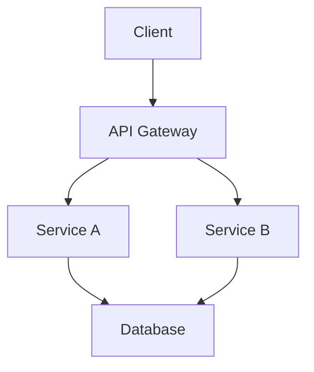

# Generate Documentation コマンド

---
allowed-tools: Read, Glob, Grep, Write, MultiEdit, Bash(ls:*), Bash(find:*), Bash(tree:*), TodoWrite, WebSearch, mcp__Context7__resolve-library-id, mcp__Context7__get-library-docs
denied-tools: Bash(rm:*), Bash(git push:*), Bash(git commit:*)
description: 複数フォーマットサポートを含む包括的なドキュメント生成
argument-hint: <コンポーネント名|"all"> [フォーマット: markdown|jsdoc|sphinx|typedoc]
---

## コンテキスト

- プロジェクトタイプ: `!ls package.json Cargo.toml go.mod pyproject.toml build.gradle pom.xml 2>/dev/null | head -1`
- ドキュメントファイル: `!find . -name "*.md" -o -name "*.txt" | grep -E "(README|readme|CONTRIBUTING|LICENSE|CHANGELOG)" | head -10`
- ソース構造: `!tree -d -L 2 src/ lib/ app/ pkg/ 2>/dev/null | head -20`
- 現在のドキュメント: `!ls docs/ doc/ documentation/ 2>/dev/null | head -10`

## タスク

開発者体験とプロジェクト理解を向上させるインテリジェントで包括的なドキュメントを生成します。

## ドキュメント生成戦略

### 1. **インテリジェント分析フェーズ**

#### コード理解
- 関数シグネチャと型情報を抽出
- コードコメントとdocstringを分析
- モジュールの依存関係と関係を特定
- デザインパターンとアーキテクチャの決定を検出

#### プロジェクトコンテキスト
- プロジェクトタイプとフレームワークを決定
- ドキュメント規約を特定
- 既存のドキュメント構造を分析
- ターゲットオーディエンスを理解（開発者、ユーザー、コントリビューター）

### 2. **ドキュメントタイプ**

#### APIリファレンス
- **関数/メソッド**: シグネチャ、パラメータ、戻り値、例外
- **クラス/インターフェース**: プロパティ、メソッド、継承
- **型/列挙型**: 値、使用法、制約
- **モジュール/パッケージ**: エクスポート、依存関係、目的

#### アーキテクチャドキュメント
- **システム概要**: 高レベルアーキテクチャ図
- **コンポーネントマップ**: モジュールの関係と相互作用
- **データフロー**: システム内でのデータの流れ
- **決定ログ**: 主要なアーキテクチャの選択と根拠

#### 開発者ガイド
- **セットアップ手順**: 前提条件、インストール、設定
- **開発ワークフロー**: ビルド、テスト、デバッグ手順
- **コントリビューションガイド**: コードスタイル、PRプロセス、テスト要件
- **トラブルシューティング**: 一般的な問題と解決策

#### ユーザードキュメント
- **はじめに**: クイックスタートガイド
- **機能ガイド**: 詳細な機能説明
- **例**: 実世界の使用シナリオ
- **FAQ**: よくある質問

### 3. **フォーマットサポート**

#### Markdown（デフォルト）
- GitHub風味のマークダウン
- アーキテクチャ用のMermaid図
- 構文ハイライト付きコードブロック
- 目次の生成

#### JSDoc
- JavaScript/TypeScriptドキュメント
- 自動型抽出
- サンプルコード生成
- ドキュメントジェネレーターとの互換性

#### Sphinx（Python）
- reStructuredTextフォーマット
- Autodoc統合
- 相互参照
- 複数の出力フォーマット

#### TypeDoc
- TypeScript固有のドキュメント
- 型認識ドキュメント
- 継承図
- モジュール構造の視覚化

## ドキュメントワークフロー

### フェーズ1: 発見
1. **プロジェクト分析**
   - プロジェクトタイプと構造を検出
   - メインエントリポイントを特定
   - モジュール依存関係をマップ
   - 既存のドキュメントを見つける

2. **コード解析**
   - パブリックAPIを抽出
   - 型定義を解析
   - インラインドキュメントを収集
   - 使用パターンを特定

### フェーズ2: 生成
1. **構造作成**
   - ドキュメント階層を構築
   - ナビゲーション構造を作成
   - 目次を生成
   - 相互参照を設定

2. **コンテンツ生成**
   - APIドキュメントを作成
   - 使用例を作成
   - 図を生成
   - コードスニペットを追加

### フェーズ3: 強化
1. **品質チェック**
   - すべてのパブリックAPIがドキュメント化されていることを確認
   - コード例を検証
   - リンクの有効性をチェック
   - 一貫したフォーマットを確保

2. **最適化**
   - 検索キーワードを追加
   - インデックスページを作成
   - 読みやすさのために最適化
   - インタラクティブ要素を追加

### フェーズ4: 統合
1. **ドキュメントサイト**
   - ドキュメント構造を設定
   - ビルドプロセスを設定
   - CI/CD統合を追加
   - ドキュメントをデプロイ

## 出力テンプレート

### メインドキュメント（README.md）
```markdown
# [プロジェクト名]

> [プロジェクトの簡潔で魅力的な説明]

[](link)
[](link)
[](link)

## ✨ 特徴

- 🚀 [主要機能1]
- 🔧 [主要機能2]
- 📦 [主要機能3]

## 📋 必要条件

- Node.js >= 14.0.0 (または適切な要件)
- その他の依存関係

## 🚀 クイックスタート

```bash
# インストール
npm install [package-name]

# 基本的な使用例
[コード例]
```

## 📖 ドキュメント

- [API リファレンス](./docs/api.md)
- [アーキテクチャガイド](./docs/architecture.md)
- [コントリビューションガイド](./CONTRIBUTING.md)

## 💻 使用例

### 基本的な使用法
```javascript
[実践的なコード例]
```

### 高度な使用法
```javascript
[より複雑な例]
```

## 🔧 設定

| オプション | タイプ | デフォルト | 説明 |
|-----------|--------|------------|------|
| option1   | string | 'default'  | 説明 |

## 🤝 コントリビューション

コントリビューションを歓迎します！詳細は[CONTRIBUTING.md](./CONTRIBUTING.md)をご覧ください。

## 📄 ライセンス

[ライセンス名] - 詳細は[LICENSE](./LICENSE)ファイルをご覧ください。
```

### APIドキュメントテンプレート
```markdown
# API リファレンス

## モジュール: [モジュール名]

### 概要
[モジュールの目的と機能の説明]

### インポート
```javascript
import { functionName } from 'module-name';
// または
const { functionName } = require('module-name');
```

### 関数

#### `functionName(param1, param2, options?)`

[関数の詳細な説明]

##### パラメータ

| 名前 | タイプ | 必須 | デフォルト | 説明 |
|------|--------|------|------------|------|
| param1 | string | ✓ | - | パラメータの説明 |
| param2 | number | ✓ | - | パラメータの説明 |
| options | Object | ✗ | {} | オプション設定 |
| options.flag | boolean | ✗ | false | フラグの説明 |

##### 戻り値

`Promise<ResultType>` - 戻り値の説明

##### エラー

- `TypeError` - 無効なパラメータが渡された場合
- `CustomError` - 特定の条件でスローされる

##### 使用例

```javascript
// 基本的な使用法
const result = await functionName('value', 123);

// オプション付き
const result = await functionName('value', 123, {
  flag: true
});

// エラーハンドリング
try {
  const result = await functionName('value', 123);
} catch (error) {
  console.error('エラーが発生しました:', error.message);
}
```
```

### アーキテクチャドキュメントテンプレート
```markdown
# アーキテクチャドキュメント

## システム概要



## コンポーネント説明

### [コンポーネント名]
- **責務**: [主な責任]
- **依存関係**: [他のコンポーネントとの関係]
- **技術スタック**: [使用技術]

## データフロー

[データがシステムを通じてどのように流れるかの説明]

## 設計決定

### [決定事項]
- **背景**: [なぜこの決定が必要だったか]
- **選択肢**: [検討した選択肢]
- **決定**: [選択した解決策]
- **理由**: [この選択をした理由]
```

## 高度な機能

### インテリジェントドキュメント
- 文書化されていないコードを自動検出
- コード分析から意味のある説明を生成
- リアルな使用例を作成
- パフォーマンスの考慮事項を追加

### 多言語サポート
- プロジェクトの主要言語を検出
- 適切な言語でドキュメントを生成
- バイリンガルドキュメントをサポート

### 統合機能
- GitHub Pagesのセットアップ
- ドキュメントCI/CD
- バージョン管理
- 検索機能

## ユーザー追加指示

$ARGUMENTS